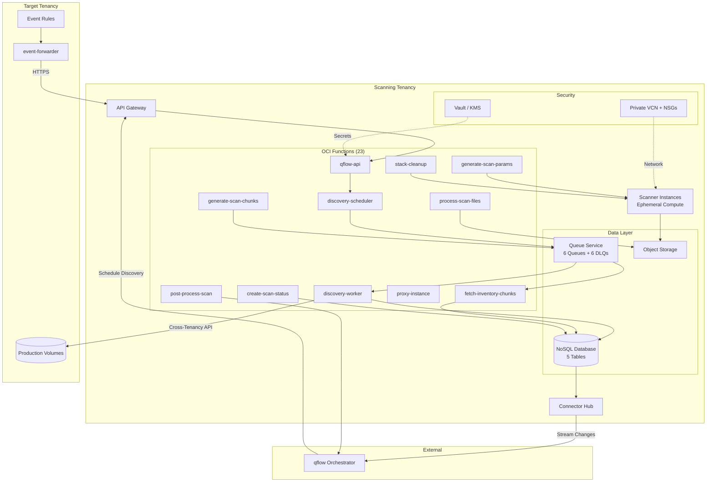
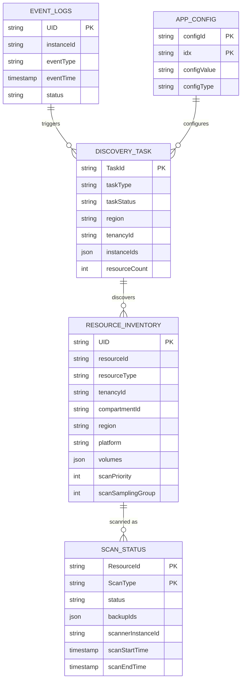
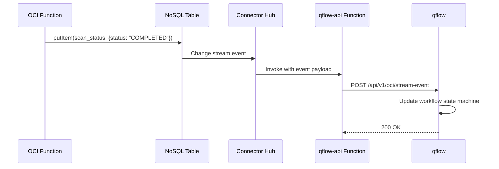
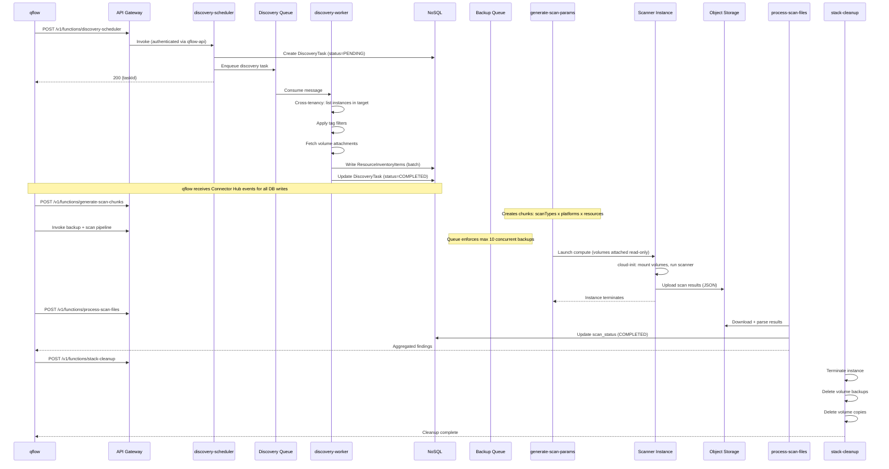
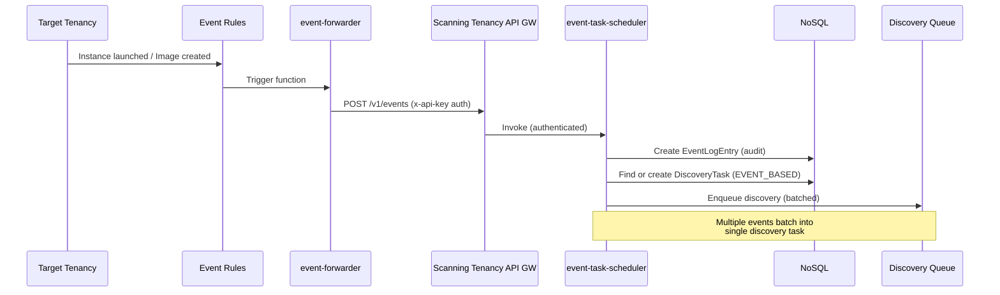
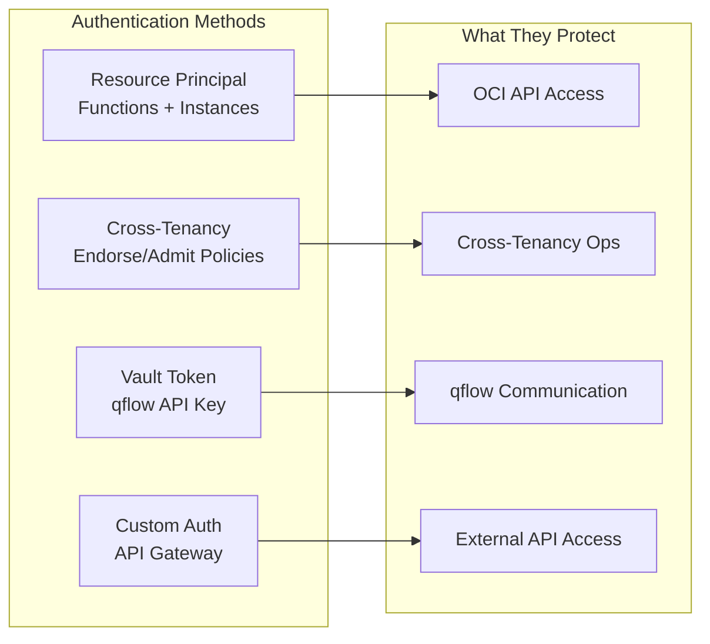

# Building an OCI-Native Cross-Tenancy Snapshot Scanning Platform

**How we built a serverless, queue-driven scanning engine that federates across OCI tenancy boundaries to perform agentless volume-level security scanning at scale.**

---

## The Problem

You have hundreds of compute instances spread across multiple OCI tenancies. You need to scan their volumes for vulnerabilities, software composition issues, and secrets. You can't install agents on production workloads. And you need to do it without storing a single credential in your codebase.

This is the snapshot scanning problem, and solving it in OCI required us to rethink everything from the ground up.

## Why Not Just Port the AWS Version?

We had a working AWS implementation. Cross-account IAM roles, Lambda functions, DynamoDB, SQS, the usual playbook. The naive approach would be to find the OCI equivalent of each service and swap them in. But OCI's tenancy model is fundamentally different from AWS's account model, and that difference ripples through every architectural decision.

In AWS, cross-account access is a first-class primitive. You assume a role and you're operating in the target account. In OCI, tenancies are hard boundaries. Cross-tenancy access requires **endorse/admit policy pairs** at the root compartment level of both tenancies. There's no "assume role" equivalent. Your identity stays in your home tenancy, and the target tenancy's policies explicitly admit your dynamic group to perform specific operations.

This isn't a limitation, it's actually a stronger security model. But it means your architecture has to be designed around it from the start.

## Architecture

The platform has two deployment footprints: a heavyweight **Scanning Tenancy** (central hub with all infrastructure) and a lightweight **Target Tenancy** (just a cross-tenancy policy and an optional event forwarder).



## The Cross-Tenancy Federation Model

This is the foundation everything else builds on. Let's look at how it actually works.

### Identity: Dynamic Groups

OCI Functions authenticate via **Resource Principals**. No API keys, no stored credentials. Instead, you define dynamic groups that match resources by compartment:

```hcl
resource "oci_identity_dynamic_group" "snapshot_scanner_functions" {
  name        = "snapshot-scanner-functions"
  description = "All functions in the scanner compartment"
  matching_rule = "ALL {resource.type = 'fnfunc', resource.compartment.id = '${var.compartment_id}'}"
}
```

### Endorse (Scanning Tenancy)

The scanning tenancy says: "I endorse my scanner functions to operate in other tenancies."

```hcl
allow dynamic-group snapshot-scanner-functions to manage volume-backups in any-tenancy
allow dynamic-group snapshot-scanner-functions to manage boot-volume-backups in any-tenancy
allow dynamic-group snapshot-scanner-functions to read instances in any-tenancy
allow dynamic-group snapshot-scanner-functions to read volumes in any-tenancy
```

### Admit (Target Tenancy)

Each target tenancy says: "I admit the scanning tenancy's function group to perform these operations here."

```hcl
define tenancy scanning as ocid1.tenancy.oc1..scanning-tenancy-id
define dynamic-group scanner-functions as ocid1.dynamicgroup.oc1..scanner-dg-id

admit dynamic-group scanner-functions of tenancy scanning to manage volume-backups in tenancy
admit dynamic-group scanner-functions of tenancy scanning to read instances in tenancy
```

The result: functions in the scanning tenancy can call OCI APIs against target tenancies with zero stored credentials. The identity verification happens at the IAM layer, and both sides have to explicitly agree.

## Queue-Driven Workflow Engine

The entire scanning lifecycle is decomposed into six phases, connected by queues. This is not a monolithic state machine running in a single process. Each phase is a set of independent, idempotent functions that consume from queues and produce to queues or NoSQL tables.

```mermaid
flowchart LR
    subgraph "Phase 1: Discovery"
        A[discovery-scheduler] -->|Queue| B[discovery-worker]
    end

    subgraph "Phase 2: Planning"
        B -->|NoSQL| C[generate-scan-chunks]
        C -->|Queue| D[fetch-inventory-chunks]
        D -->|NoSQL| E[create-scan-status]
    end

    subgraph "Phase 3: Backup"
        E -->|Queue| F[Backup Orchestration]
        F -->|Cross-Tenancy| G[Volume Backups]
    end

    subgraph "Phase 4: Scanning"
        G --> H[generate-scan-params]
        H --> I[Scanner Instance<br/>Launch + Scan]
    end

    subgraph "Phase 5: Results"
        I -->|Object Storage| J[process-scan-files]
        J --> K[post-process-scan]
    end

    subgraph "Phase 6: Cleanup"
        K -->|Queue| L[stack-cleanup]
        L -->|Terminate Instance<br/>Delete Backups| M[Done]
    end
```



### Why queues and not direct function chaining?

Three reasons:

1. **Backpressure.** OCI limits concurrent volume backups to 10 per tenancy/region. The `snapshot-backup-requests` queue has a channel limit of 10, naturally throttling without any custom rate limiting code.

2. **Failure isolation.** If a scan fails, the message goes to the DLQ after 3 attempts. Other scans continue unaffected. No cascading failures, no circuit breakers needed.

3. **Resumability.** Every function is idempotent. If the entire system stops and restarts, messages still sitting in queues will be processed. No lost work, no duplicate scans (NoSQL conditional puts handle deduplication).

### The 5-Minute Constraint

OCI Functions have a 5-minute execution timeout. That sounds limiting, but it's actually a forcing function for better design.

Instead of long-running operations, we use a **polling pattern**: a function kicks off an async operation (volume backup, instance launch), writes the operation ID to NoSQL, and returns. A scheduled check function (`scheduled-fn-check`) polls for completion and enqueues the next step when the operation finishes.

This gives us:
- Automatic checkpoint/restart (the state is in NoSQL, not in memory)
- Observability (every state transition is a NoSQL write, streamed via Connector Hub)
- Cost efficiency (no idle compute waiting for backups to complete)

## Data Architecture

Five NoSQL tables track the entire scanning lifecycle:



All tables (except `app_config`) have a 30-day TTL. Scan data is ephemeral by design. The source of truth for historical findings lives in the qflow platform, not here.

### Connector Hub: Real-Time State Streaming

Every write to these NoSQL tables generates a change event. OCI Connector Hub captures these changes and streams them to the `qflow-api` function, which forwards them to the external orchestrator.



This eliminates polling entirely. qflow has a real-time, eventually-consistent view of every scan's progress. When a discovery completes, qflow knows immediately. When a scan finishes, qflow knows immediately. The latency is sub-second in practice.

## The Scanning Pipeline in Detail

Let's trace a single scan from trigger to cleanup.



### Tag-Based Filtering

Not every instance needs scanning. The `discovery-worker` applies a multi-layer tag filter:

- **mustHaveTags**: Instance must have all of these tags (e.g., `Environment=production`)
- **anyInListTags**: Instance must have at least one of these tags
- **noneInTheList**: Exclude instances with any of these tags (e.g., `ScanExempt=true`)
- **noneOnVolume**: Exclude volumes with specific tags

This is configured centrally in the `app_config` table and applied consistently across all discovery modes.

### Scanner Instance Lifecycle

Scanner instances are fully ephemeral. They:

1. Boot from a pre-built custom image containing scanner binaries
2. Receive volume attachment IDs and scan parameters via instance metadata
3. Execute cloud-init: wait for volume attachment, mount read-only, run scan
4. Upload structured JSON results to Object Storage
5. Self-terminate (or get cleaned up by `stack-cleanup`)

The scanner communicates with qflow during the scan via `proxy-instance`, which forwards HTTP requests from the private VCN to the scanner's port 8000. This allows qflow to monitor scan progress without the scanner needing a public IP.

## Event-Driven Scanning

Scheduled scans catch everything, but there's a gap between when a new instance launches and the next scheduled scan. Event-based scanning closes that gap.



The event forwarder is the only component deployed in the target tenancy (besides the root compartment policy). It runs in a minimal VCN with just a NAT gateway for outbound HTTPS. The event rules fire on `com.oraclecloud.computeapi.launchinstance.end` and `com.oraclecloud.computeapi.createimage.end`.

Events are batched into discovery tasks rather than triggering individual scans. This prevents thundering herd problems when auto-scaling groups launch 50 instances simultaneously.

## The qflow Orchestrator

qflow is the brain. The scanning platform (this repo) provides the muscles and nervous system, but qflow decides what to scan, when, and what to do with the results.

### What qflow needs to implement

qflow is a stateful workflow engine that:

1. **Schedules periodic discovery** across all registered target tenancies
2. **Consumes Connector Hub streams** to maintain a real-time view of scanning state
3. **Drives phase transitions** - when discovery completes, trigger planning; when planning completes, trigger backup; and so on
4. **Manages concurrency** - respect per-region limits, handle priorities
5. **Aggregates results** - consume scan findings and integrate into the security platform
6. **Handles failures** - retry, escalate, alert on persistent failures

### The API contract

The scanning platform exposes these integration points for qflow:

| Endpoint | Direction | Purpose |
|----------|-----------|---------|
| `POST /v1/functions/{name}` | qflow -> scanning | Invoke any function directly |
| `POST /v1/events` | target -> scanning | Receive forwarded events |
| Connector Hub streams | scanning -> qflow | Real-time NoSQL change events |
| `POST /api/v1/oci/stream-event` | scanning -> qflow | Formatted state changes |
| `POST /api/v1/oci/scan-results` | scanning -> qflow | Completed scan findings |

### How it works today

The scanning platform is fully functional without a complete qflow implementation. The functions are independently invocable, the queues handle inter-phase coordination, and every function is idempotent. Today, the workflow can be driven by:

- **Direct API calls** through the API Gateway to invoke functions in sequence
- **Simple scripts** that poll NoSQL tables and call the next function when a phase completes
- **Manual orchestration** for testing and development, calling functions one at a time

The queue-based architecture means that once resources are enqueued for backup, the backup -> scan -> cleanup pipeline runs autonomously. qflow's primary role is deciding *what* to scan and *when*, not managing the low-level execution flow.

This design was intentional: the scanning infrastructure should be a self-contained engine that qflow drives, not a tightly-coupled system that can't function without it.

## Security Deep Dive

Zero stored credentials. This bears repeating because it's the single most important architectural property.



- **Functions** authenticate to OCI APIs via Resource Principal. The identity is derived from the function's compartment and the dynamic group matching rule. No API key configuration needed.
- **Scanner instances** authenticate the same way, via a separate dynamic group matching on the `App=snapshot-scanner` freeform tag.
- **Cross-tenancy access** uses endorse/admit policies. The scanning tenancy's identity is verified by OCI IAM, and the target tenancy's policies explicitly allow specific operations.
- **qflow communication** uses a bearer token stored in OCI Vault with HSM encryption. The token is retrieved at runtime by the `qflow-api` function, never hardcoded.
- **API Gateway** uses a custom authentication function that validates the `x-api-key` header against the Vault-stored token.

Network isolation adds another layer: functions and scanner instances run in private subnets. Scanner instances have a dedicated NSG that restricts traffic to internal scanning operations. The only public endpoint is the API Gateway, which is authenticated.

## Operational Characteristics

### Scaling

| Dimension | Limit | Enforced By |
|-----------|-------|-------------|
| Concurrent backups per tenancy/region | 10 | Queue channel limit (OCI platform constraint) |
| Concurrent scans per region | Configurable | Queue channel limit |
| Discovery parallelism | Unbounded | Queue consumer count |
| Function execution time | 5 minutes | OCI platform, mitigated by polling pattern |
| Post-processing throughput | 10 concurrent | Queue channel limit |

### Failure Handling

Every queue has a dead-letter queue. Messages fail to DLQ after 3 delivery attempts. The `snapshot-failed-errors` queue aggregates error details for analysis.

`scheduled-fn-check` runs periodically to detect stalled operations: scans stuck in `SCANNING` state beyond the timeout, backups that never completed, instances that weren't cleaned up. It re-enqueues work or triggers cleanup as needed.

Every function is idempotent. Calling `create-scan-status` twice for the same resource and scan type is a no-op (NoSQL conditional put). Calling `stack-cleanup` on an already-terminated instance succeeds gracefully. This makes retry safe at every level.

### Observability

- **Structured logging** via a shared `logger` library, JSON format for OCI Logging ingestion
- **Connector Hub streams** provide a real-time event feed of every state transition
- **NoSQL tables** are the source of truth and can be queried directly for debugging
- **Monitoring alarms** fire on function errors, queue depth thresholds, and scan timeouts
- **Dashboards** visualize scan throughput, failure rates, and resource utilization

## What We Learned

### OCI's strengths for this workload
- **Cross-tenancy federation** is more secure than AWS cross-account roles. Both sides must explicitly agree, and the policies are granular.
- **Resource Principal auth** eliminates credential management entirely. No rotation, no secrets in config, no risk of leaked API keys.
- **Connector Hub** is underrated. Real-time change streaming from NoSQL to functions without managing Kafka or Kinesis.
- **Queue Service** with channel limits provides natural backpressure without custom rate limiting.

### Design patterns that paid off
- **Decomposed functions over monolithic workflows** - each function does one thing, making debugging and updates trivial.
- **Queues as the integration layer** - loose coupling between phases, natural error handling via DLQs, backpressure for free.
- **NoSQL as the state store with change streams** - every state transition is durable and observable. Combined with Connector Hub, you get event sourcing without building event sourcing.
- **Polling over long-running** - the 5-minute timeout felt like a constraint but actually led to a more resilient design. State lives in the database, not in function memory.

### Things to watch for
- **Cross-tenancy policies must be at root compartment level.** This is an OCI requirement that affects your organizational governance model. Plan for it early.
- **Volume backup concurrency limits** are per-tenancy per-region. If you're scanning many tenancies in the same region, each gets its own 10-backup limit. But a single tenancy scanning itself is capped at 10.
- **Connector Hub has eventual consistency.** Don't use it for synchronous coordination. Use it for monitoring and triggering the next phase with tolerance for delay.

## Getting Started

The full platform is open source. See the [README](../README.md) for deployment instructions, project structure, and configuration details.

The scanning infrastructure is self-contained and deployable today. The qflow orchestrator is a separate component with a well-defined API contract, ready to be implemented as a simple script, a containerized service, or a full workflow engine depending on your needs.
